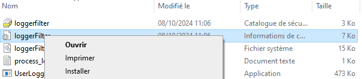
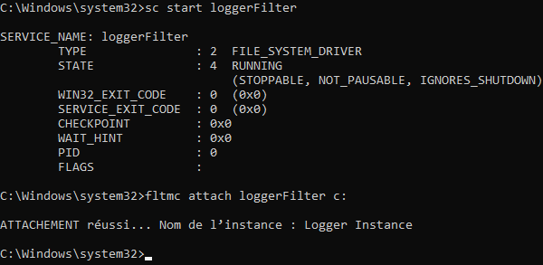
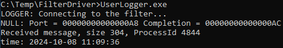
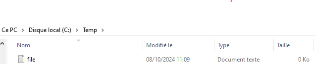
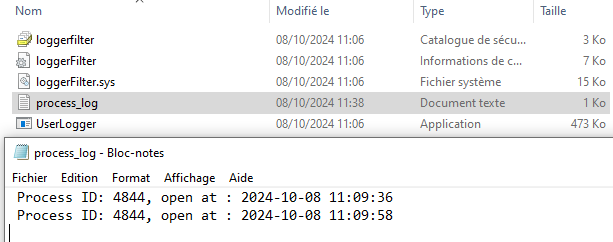

# LoggerFilter File System Minifilter Driver
The LoggerFilter minifilter is a sample file system minifilter driver that demonstrates monitoring file system activities, particularly focusing on file creation/opening events. 
It registers itself with the filter manager and communicates with a user-mode application to log these events.

## Design and Operation
The LoggerFilter minifilter keeps track of file system activity related to the IRP_MJ_CREATE operation (file creation or opening). 
It logs the process ID and the timestamp of each operation, communicating this information to a user-mode application through a kernel communication port. 
The user-mode application can manage the logging process by sending commands to the driver.

### Minifilter Design
1. **Initialization (`DriverEntry`)**:
   - The minifilter registers with the filter manager via the `FltRegisterFilter` function.
   - The `LoggerCreatePreRoutine` callback is registered to monitor the `IRP_MJ_CREATE` file system operation.
   - A communication port is created using `FltCreateCommunicationPort` to facilitate interaction between the user-mode application and the driver.
   - The `LoggerPortConnect` and `LoggerPortDisconnect` callbacks manage connections to the user-mode application.

2. **Logging (`LoggerCreatePreRoutine`)**:
   - The `LoggerCreatePreRoutine` callback is triggered before the system processes a file creation or opening operation (`IRP_MJ_CREATE`).
   - It captures the process ID of the file-accessing process and the current system time.
   - The driver sends log entries to the user-mode application through the communication port.

3. **Target File Monitoring**:
   - The driver monitors file accesses only for a specified file path (`TargetFilePath`). This path can be modified within the code or configuration.

### User-Mode Application Design
The user-mode application communicates with the minifilter driver to receive log entries. It connects to the driver’s communication port and processes the logs.

1. **Setup (`main`)**:
   - The application creates a communication port using `FilterConnectCommunicationPort` to connect with the driver.
   - Multiple threads are spawned to handle incoming log entries from the driver.

2. **Log Handling (`LoggerWorker`)**:
   - The application receives log entries, which contain the process ID and timestamp of file accesses.
   - These entries are displayed on the console and are logged into a file.

## Running the Sample
1. **Building**:
   - Open the solution in Visual Studio.
   - Build the solution.

2. **Installing the Minifilter Driver**:
   - Open a command prompt with administrative privileges.
   - To install the minifilter driver, you can right-click on `LoggerFilter.inf` and select "Install":
     
     
     
     Or you can run the following command:
     ```bash
     sc create LoggerFilter type= kernel binPath= <path to LoggerFilter.sys>
     ```
   - Start the minifilter driver with:
     ```bash
     sc start LoggerFilter
     ```
     
     

3. **Communicating with the Driver**:
   - Run the user-mode application (`LoggerFilterApp.exe`) to start receiving log entries.
     
     
     
   - To attach the minifilter driver to a specific volume (e.g., C:):
     ```bash
     fltmc attach LoggerFilter C:
     ```
4. **Try to create or open the target file**:
   - Go to the default target file : c:\Temp\file.txt
     
     
   - Check the log file :
     
     

6. **Stopping and Uninstalling**:
   - To stop the minifilter driver:
     ```bash
     sc stop LoggerFilter
     ```
   - To uninstall the minifilter driver:
     ```bash
     sc delete LoggerFilter
     ```
